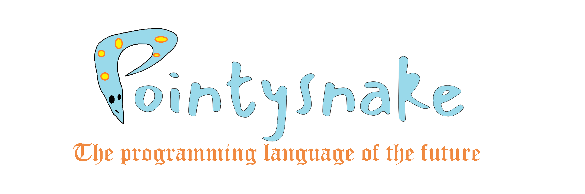

# pointysnake



Pointysnake is an incomplete programming language built using C# (pointy) and Python (snake).  The goal of pointysnake is to create a language with the speed and portability of mono executables but with the simplicity of Python.

# pointysnake is not ready for use in serious projects, please submit an issue if you encounter a bug

# hello world example
```
print("hello world!")
```

# how to compile

- make sure you have some C# runtime installed
- make sure python3.7 is installed **this project will not work with python<=3.5**
- alternately, there is a `shell.nix` provided, running `nix-shell` will automatically configure a build environment for you
- clone the GitHub repo
- write some code (I'd advise reading through some of the tests as examples)
- precompile your code by running `python build.py <filename>`.
- build the compiler from source, or go to the actions page and download the artifact called `compiler`
- place the generated file `precomp.psnbin` in the same folder as `makebin.exe` and run it (`mono makebin.exe`)
- executable called `executable.exe` will be created
